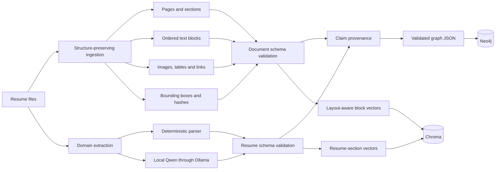
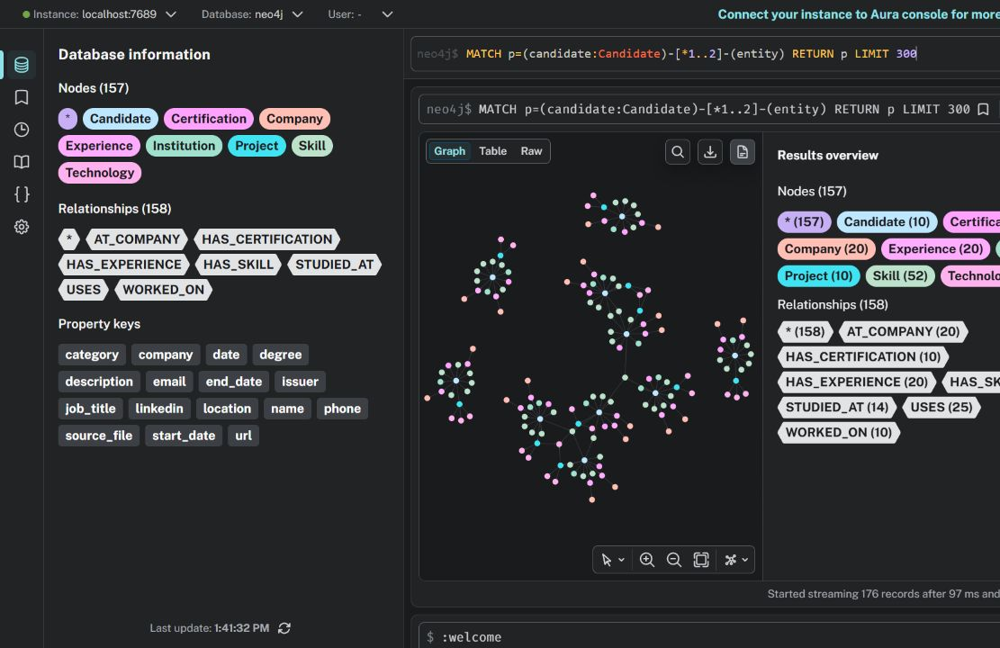

# Structure-Preserving Resume Knowledge Pipeline

> Turn resumes into validated JSON, a traceable Neo4j knowledge graph, and searchable Chroma collections without discarding document structure.

[](https://github.com/Nithyon/responsible-ai-resume-pipeline/actions/workflows/ci.yml)

[](LICENSE)

[Architecture](#architecture) · [Quickstart](#quickstart) · [Data model](#data-model) · [Demonstration](DEMO_GUIDE.md) · [Limitations](#limitations)

## The problem

A resume is not merely a sequence of text chunks. It is a structured document whose sections, layout, images, entities, and relationships carry meaning.

The common pipeline

```text
PDF → extracted text → arbitrary chunks → embeddings
```

is useful for retrieval, but it can erase page boundaries, reading order, section membership, table structure, image context, and the evidence behind an extracted claim. Once that information is removed, a language model has to guess how the document was originally organized.

This project follows a different rule:

> Preserve structure during ingestion instead of asking the model to reconstruct it later.

## Design

The pipeline deliberately keeps two operations separate:

1. **Document ingestion** records pages, sections, ordered blocks, tables, images, links, bounding boxes, and hashes.
2. **Domain extraction** maps resume facts into a stable blueprint of candidates, skills, experience, education, projects, certifications, and languages.

It also keeps two kinds of validation separate:

- **Schema validation** asks whether the output has the permitted fields and types.
- **Provenance validation** asks where an extracted value appeared in the source document.

This distinction matters. Valid JSON can still contain an unsupported claim.

## Architecture



## Representations

| Representation | Purpose | Contract |
|---|---|---|
| Structured document JSON | Preserves pages, sections, layout blocks, assets, links, and reading order | [`document.schema.json`](config/document.schema.json) |
| Resume-domain JSON | Normalizes candidate fields and repeatable resume sections | [`resume.schema.json`](config/resume.schema.json) |
| Provenance JSON | Links extracted claims to source pages, blocks, quotes, and bounding boxes | Generated by [`provenance.py`](src/provenance.py) |
| Graph JSON | Validates nodes, relationships, labels, and directions before loading Neo4j | [`neo4j_schema.json`](config/neo4j_schema.json) |
| Chroma collections | Supports semantic retrieval while retaining source metadata | [`chroma_schema.json`](config/chroma_schema.json) |

A complete synthetic ingestion example is available at [`examples/ingested_resume.json`](examples/ingested_resume.json).

## Data model

### Resume blueprint

```json
{
  "candidate": {
    "name": "",
    "email": "",
    "phone": "",
    "location": "",
    "linkedin": "",
    "portfolio": "",
    "headline": "",
    "summary": ""
  },
  "sections": {
    "skills": [],
    "experience": [],
    "education": [],
    "projects": [],
    "certifications": [],
    "languages": []
  },
  "source_document": {},
  "images": []
}
```

Candidate fields are global. Section fields are repeatable records. The ingestion JSON preserves the candidate's written name and contains no public `candidate_id`; stable internal identifiers are generated only when graph and vector records are prepared.

### Knowledge graph

The compact presentation graph uses these node labels:

- `Candidate`, `Skill`, `Company`, and `Experience`
- `Institution`, `Project`, `Certification`, and `Technology`

Its main relationships are:

- `HAS_SKILL`
- `HAS_EXPERIENCE` and `AT_COMPANY`
- `STUDIED_AT`
- `WORKED_ON` and `USES`
- `HAS_CERTIFICATION`

The full graph adds `Resume`, `Page`, `Section`, `TextBlock`, `Image`, and `Table` nodes together with `HAS_BLOCK`, `NEXT_BLOCK`, `HAS_CONTEXT`, and `EXTRACTED_FROM` relationships.



The public synthetic dataset produces **179 nodes and 208 relationships** in the domain graph. The compact presentation export contains **157 nodes and 158 relationships** because it intentionally omits internal resume records and collapses shared display entities.

## Image and table handling

The PDF ingestion stage does not insert binary images into text chunks. It:

- Saves each embedded image as a separate asset.
- Records its page, bounding box, hash, media type, and pixel dimensions.
- Associates it with the closest text blocks and a possible caption.
- Connects it to its page and section in Neo4j.
- Embeds the caption and nearby text in Chroma while retaining the asset path as metadata.

Tables keep their extracted rows, page position, section membership, and surrounding text. The committed PDF fixture uses an artificial profile illustration and synthetic information only.

## Quickstart

### Requirements

- Python 3.11 or newer
- Neo4j Desktop or Docker for graph storage
- Ollama only when using the optional Qwen extractor

### Install

```powershell
git clone https://github.com/Nithyon/responsible-ai-resume-pipeline.git
cd responsible-ai-resume-pipeline
python -m venv .venv
.\.venv\Scripts\python.exe -m pip install -r requirements.txt
Copy-Item .env.example .env
```

### Ingest the ten synthetic resumes

```powershell
.\.venv\Scripts\python.exe -m src.ingest --input data\input --output data\processed --parser deterministic
.\.venv\Scripts\python.exe -m src.validate --input data\processed --expected 10
```

Expected validation result:

```text
SCHEMA VALIDATION PASSED: 10 resume files match config\resume.schema.json.
```

### Build the domain graph

```powershell
.\.venv\Scripts\python.exe -m src.build_graph_json --input data\processed --output data\graph.json
```

This step validates the graph against [`config/neo4j_schema.json`](config/neo4j_schema.json) before writing it.

## Structure-preserving PDF path

The repository includes one reproducible synthetic PDF containing headings, text blocks, a table, a hyperlink, and an artificial profile illustration.

```powershell
.\.venv\Scripts\python.exe -m src.document_ingest --input data\pdf_samples --output data\structured --assets data\structured_assets
.\.venv\Scripts\python.exe -m src.validate_documents --input data\structured --schema config\document.schema.json
```

To regenerate the fixture itself:

```powershell
.\.venv\Scripts\python.exe scripts\generate_synthetic_pdf.py
```

## Optional Qwen extraction

Start Ollama and make the configured model available:

```powershell
ollama pull qwen2.5:7b
ollama serve
```

Then extract and validate the synthetic PDF:

```powershell
.\.venv\Scripts\python.exe -m src.ingest --input data\pdf_samples\synthetic_resume.pdf --output data\processed_pdf --parser qwen --model qwen2.5:7b
.\.venv\Scripts\python.exe -m src.validate --input data\processed_pdf --expected 1
.\.venv\Scripts\python.exe -m src.provenance --resumes data\processed_pdf --documents data\structured --output data\provenance
.\.venv\Scripts\python.exe -m src.build_graph_json --input data\processed_pdf --documents data\structured --provenance data\provenance --output data\graph.json
```

The extraction prompt requests only explicitly present facts, preserves the candidate name as printed, and uses empty values when information is absent. This reduces unsupported inference; it does not make model output infallible.

## Neo4j

### Full validated graph

Set the connection values in `.env`, start Neo4j, and run:

```powershell
.\.venv\Scripts\python.exe -m src.load_graph_json --input data\graph.json --reset
```

`--reset` removes the graph in the selected Neo4j database. Use a dedicated development database.

### Compact presentation graph

The presentation export intentionally limits node types and property keys so Neo4j's Database Information panel remains readable.

```powershell
.\.venv\Scripts\python.exe -m src.export_demo_graph --input data\processed --output data\neo4j_demo_import
docker compose up -d
Get-Content config\neo4j_demo_import.cypher | docker compose exec -T neo4j cypher-shell -u neo4j -p resume-password
```

Useful demonstration queries:

```cypher
// Candidate-centred graph
MATCH p=(candidate:Candidate)-[*1..2]-(entity)
RETURN p
LIMIT 300;
```

```cypher
// Candidates who list Python
MATCH (candidate:Candidate)-[:HAS_SKILL]->(skill:Skill)
WHERE toLower(skill.name) = 'python'
RETURN candidate.name, candidate.location, skill.name;
```

```cypher
// Projects and their technologies
MATCH (candidate:Candidate)-[:WORKED_ON]->(project:Project)
OPTIONAL MATCH (project)-[:USES]->(technology:Technology)
RETURN candidate.name, project.name, collect(technology.name) AS technologies;
```

## Chroma

Load and search the domain-section collection:

```powershell
.\.venv\Scripts\python.exe -m src.chroma_store load --input data\processed --reset
.\.venv\Scripts\python.exe -m src.chroma_store query "streaming data pipelines" --top-k 5
```

Load and search layout-aware source blocks:

```powershell
.\.venv\Scripts\python.exe -m src.structured_chroma load --input data\structured --reset
.\.venv\Scripts\python.exe -m src.structured_chroma query "profile illustration and data systems experience" --top-k 5
```

The first collection answers questions about normalized resume sections. The second returns source blocks together with page, section, bounding-box, content-type, and asset-path metadata.

## Validation and responsible AI

Reliability begins before the final model response:

- JSON Schema constrains fields, types, required values, and unexpected properties.
- The graph schema constrains labels, relationship types, and valid directions.
- Source hashes identify the exact document version that was ingested.
- Provenance records show the page and block supporting each matched claim.
- Ungrounded claims remain visible for review instead of silently becoming trusted facts.
- Qwen runs locally through Ollama; resumes do not need to be sent to a hosted model.

Run the complete synthetic test suite:

```powershell
.\.venv\Scripts\python.exe -m pytest -q
```

Verified locally on Python 3.14: **11 tests passed**. A Chroma dependency may emit an `asyncio.iscoroutinefunction` deprecation warning on Python 3.14; it does not indicate a pipeline failure.

## Project map

```text
config/             JSON Schema and Neo4j import contracts
data/input/          ten synthetic resume sources
data/pdf_samples/    reproducible synthetic PDF and illustration
docs/images/         sanitized documentation visuals
examples/            public example outputs
scripts/             fixture-generation utilities
src/                 ingestion, validation, graph and vector pipelines
tests/               synthetic, privacy-safe tests
```

## Limitations

- Scanned PDFs require OCR, which is not included.
- Highly unusual or multi-column layouts can affect reading order.
- Contextual image association is not the same as full visual understanding.
- Qwen can omit or misclassify information even when its JSON is schema-valid.
- Text matching can leave ambiguous claims ungrounded and in need of human review.
- The deterministic parser expects the marked synthetic text format; arbitrary resumes should use the Qwen path.

## Privacy

This repository contains synthetic resumes only. Real resumes, candidate photographs, generated databases, provenance records, and private exports are excluded from Git.

Resume data is personal data. Obtain consent, apply appropriate retention controls, and do not attach real resumes to public GitHub issues.

## License and citation

The code is released under the [MIT License](LICENSE). Citation metadata is available in [`CITATION.cff`](CITATION.cff).
